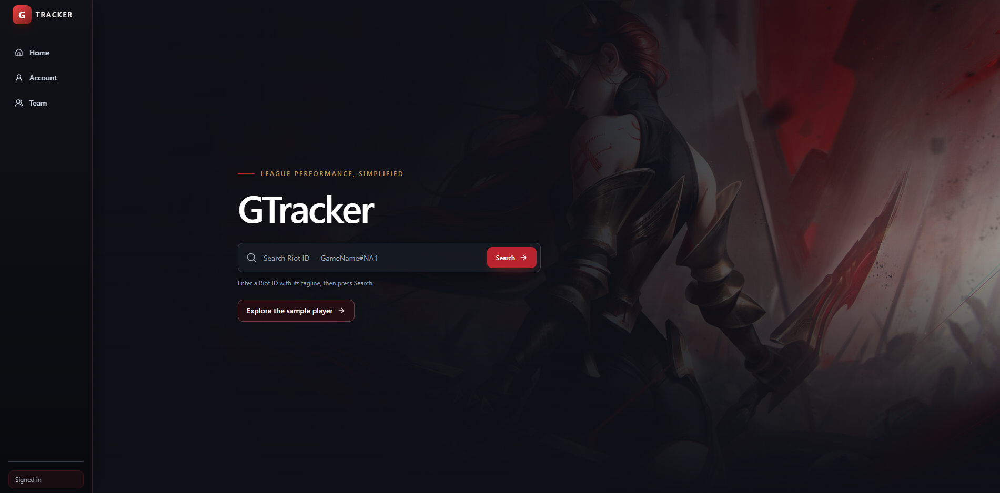
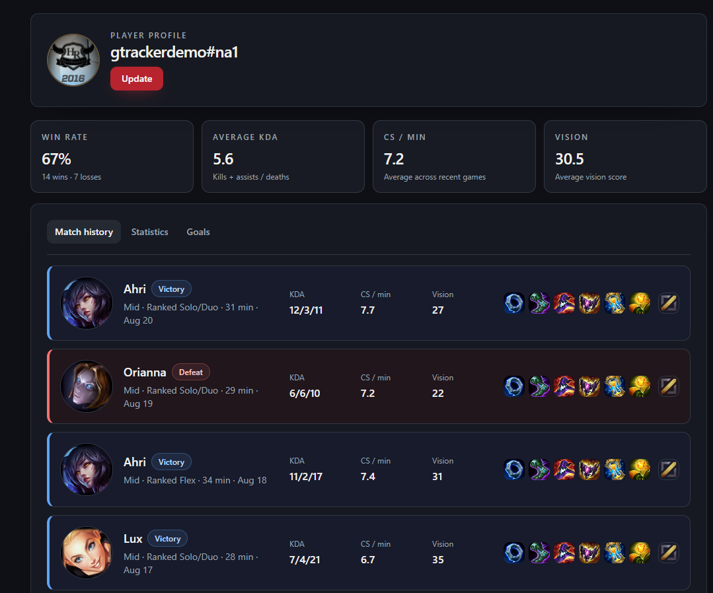
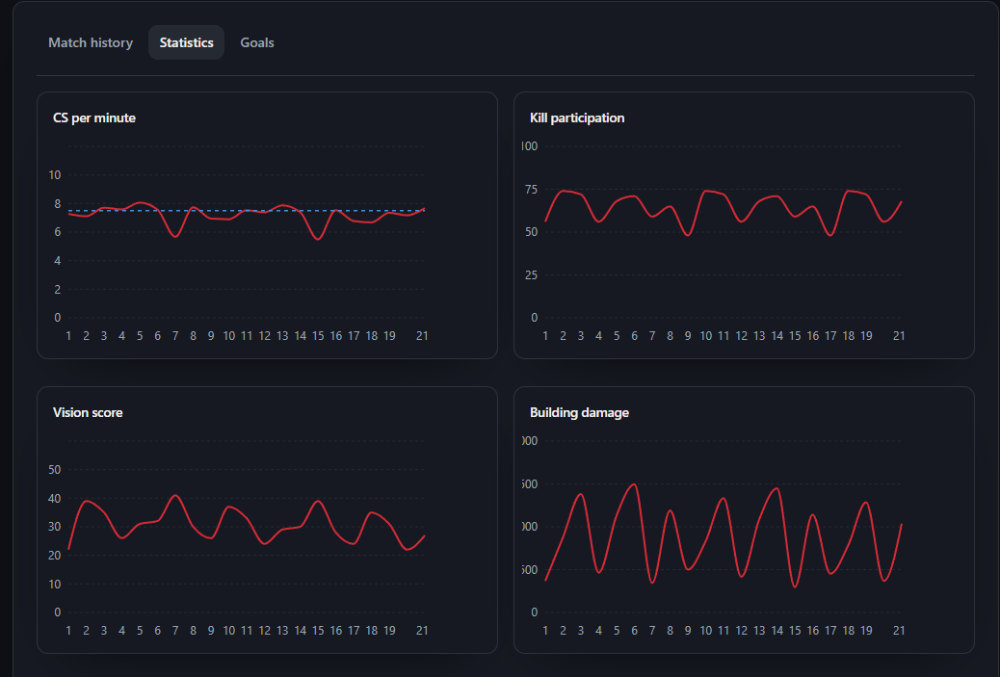
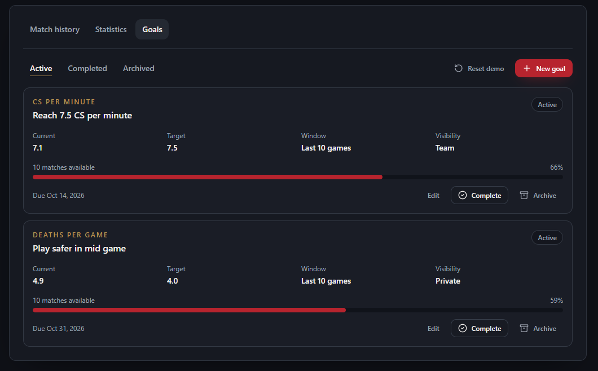
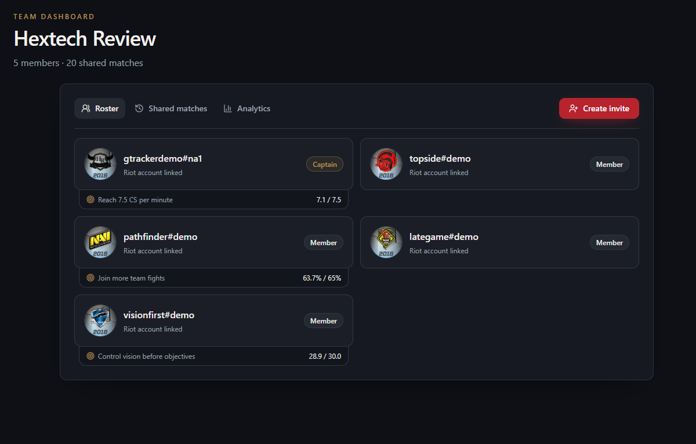
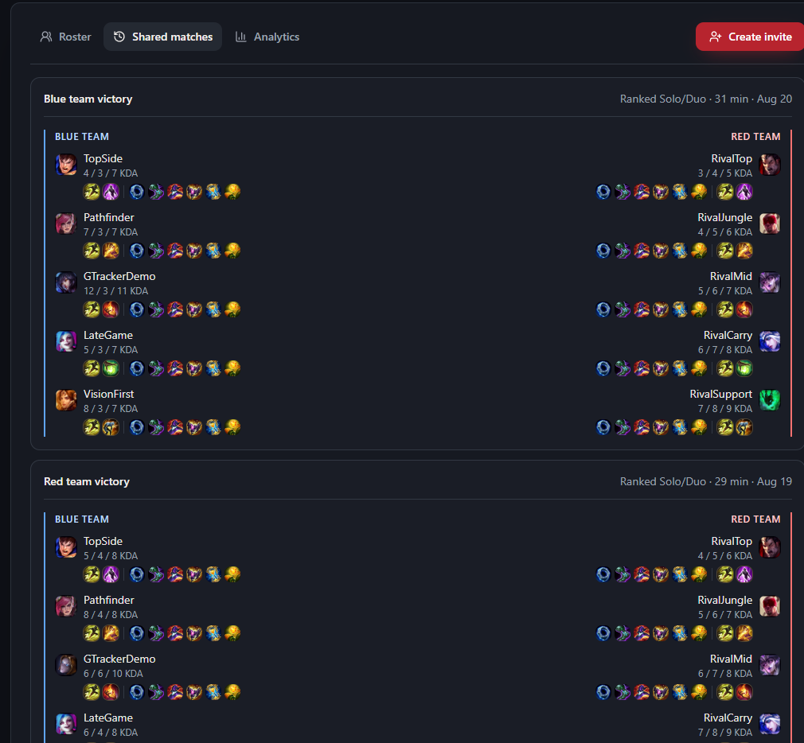
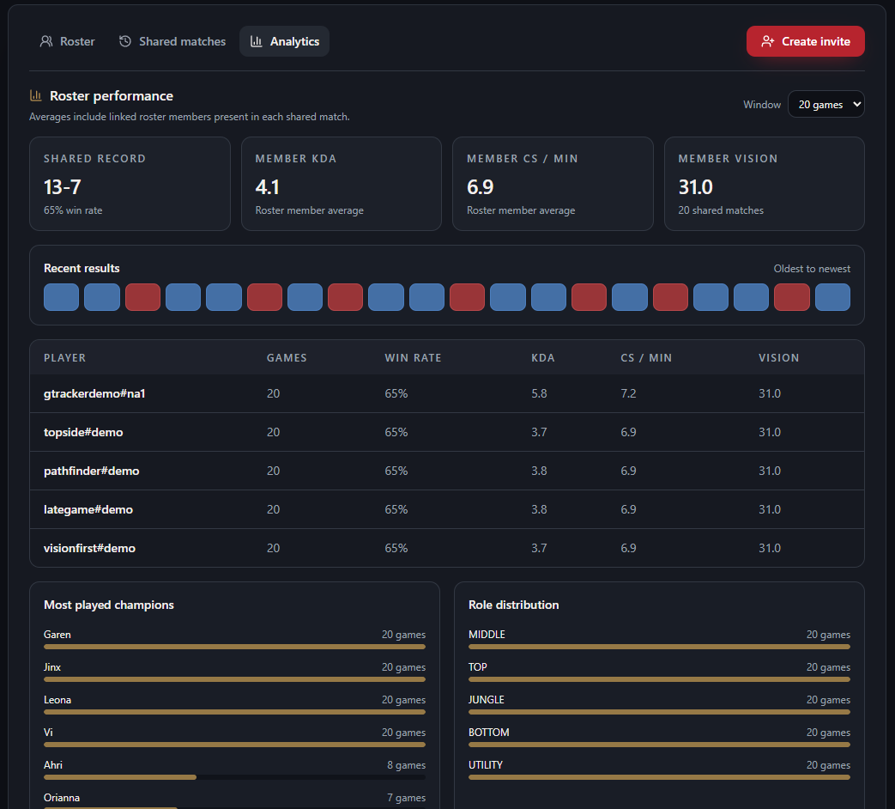

# GTracker — League of Legends Performance & Team Analytics

**A full-stack League of Legends companion for reviewing player performance, tracking measurable goals, and bringing team statistics into one place.**

**Built:** Late 2024–early 2025  
**Status:** Completed personal project · No longer in active development

[**Try GTracker →**](https://gtracker-pi.vercel.app/)

---

## Overview

I originally built GTracker for my semester's esports team.

At the time, reviewing player performance meant jumping between several separate OP.GG profiles and trying to piece together everyone's recent results. I wanted one place where our team could connect player accounts, review match history and statistics, track measurable goals, and look at shared team performance together.

GTracker connects a local account to a **Riot ID**, imports recent League of Legends match data, and turns that data into player statistics, trends, goals, and team-level views.

The main workflow is:

**Create account → Link Riot ID → Import matches → Review stats → Track goals → Join a team → Review shared matches and team analytics**

The public demo uses synthetic data so the full product can be explored without exposing real player information or requiring live Riot or MongoDB access.

GTracker is an independent personal project and is not affiliated with Riot Games or OP.GG.

---

## Product Walkthrough

### 1. Landing Page

Players can search for a Riot ID or open the sample player directly.

  

### 2. Player Profile & Match History

A player profile summarizes recent performance and displays imported League of Legends matches with champion, result, K/D/A, CS/min, vision score, item build, queue, and match date.

  

### 3. Player Analytics

GTracker converts recent match data into readable performance trends.

The analytics view includes metrics such as:

- CS per minute
- Kill participation
- Vision score
- Building damage
- Win rate
- KDA
- Champion frequency

  

### 4. Performance Goals

Players can create measurable goals tied to their match statistics.

Goals can track metrics such as KDA, CS/min, vision score, kill participation, win rate, deaths per game, control wards, and building damage.

Each goal includes a target, recent-match window, current value, progress, and visibility setting. Goals can be private or visible to teammates.

  

### 5. Team Dashboard

Players can create or join a team through invite codes.

The team dashboard brings roster information and team-visible player goals into one shared view.

  

### 6. Shared Team Matches

GTracker identifies games where linked teammates played together on the same Riot team and displays the full match context in one place.

This made it easier to review team games without opening each player's profile individually.

  

### 7. Team Analytics

The team analytics view summarizes shared-match performance and compares roster members across recent games.

It includes:

- Shared-match wins and losses
- Team win rate
- Average member KDA
- Average CS/min
- Average vision score
- Recent win/loss trend
- Per-player comparison
- Champion frequency
- Role distribution

  

---

## What It Does

GTracker centralizes individual and team League of Legends performance data.

Key functionality includes:

- Local account creation and authentication
- Riot ID linking
- Recent match importing
- Match-ID deduplication
- Player statistics and charts
- Persistent performance goals
- Team creation and invite codes
- Manager/member permissions
- Shared-match detection
- Team-visible goals
- Team performance analytics
- Responsive desktop/mobile interface

---

## Riot Data Flow

GTracker resolves a Riot identity and imports recent match information through the following flow:

**Riot ID → PUUID → Recent Match IDs → Match Details → Saved History → Analytics**

Existing match IDs are reused so refreshes only request match payloads that are not already stored.

For team analytics, GTracker also deduplicates matches across player histories and verifies that roster members were on the same Riot team before counting a match as a shared team game.

---

## Tech Stack

**Frontend:** React · Next.js · Tailwind CSS · Recharts  
**Backend:** Next.js route handlers · Node.js  
**Database:** MongoDB · Mongoose  
**Authentication:** bcrypt · JWT · HTTP-only cookies  
**External API:** Riot Games API  
**Testing:** 18 focused unit tests  
**UI:** Radix UI · Lucide icons · ShadCN

---

## Testing

GTracker includes **18 focused unit tests** covering areas such as:

- Session and JWT behavior
- Riot ID parsing
- Player-stat calculations
- Goal progress and completion
- Safe API error handling
- Shared-match deduplication
- Same-team qualification
- Opponent exclusion
- Team trend ordering

ESLint also passes on the current version.

---

## Demo

A public demo is available here:

### [**Open GTracker →**](https://gtracker-pi.vercel.app/)

The demo uses synthetic data so the application can be explored without a real Riot account.

In demo mode:

- Riot API requests are disabled
- MongoDB is bypassed
- Player, match, and team data are synthetic
- Goal changes are stored only in the visitor's browser
- No real credentials or private player information are used

---

## Project Status

GTracker is **complete and no longer in active development**.

It was built in late 2024 and early 2025 for my semester's esports team as a way to centralize player and team information that otherwise required checking multiple separate profiles.

If I rebuilt GTracker today, I would likely use TypeScript, normalize match and participant data into dedicated collections, add more robust Riot API retry/rate-limit handling, and expand integration testing.
I would like to merge GTracker with my VOD review platform to create an all in one esports dashboard for teams. 
---

## Source Code

The original working repository remains private.

---

## About Me

**Greyson Denison-Fischer**  
Computer Science student at Central Michigan University  
Graduating May 2027

[LinkedIn](https://www.linkedin.com/in/greyson-fischer/) · [GitHub](https://github.com/dgreyson3)
